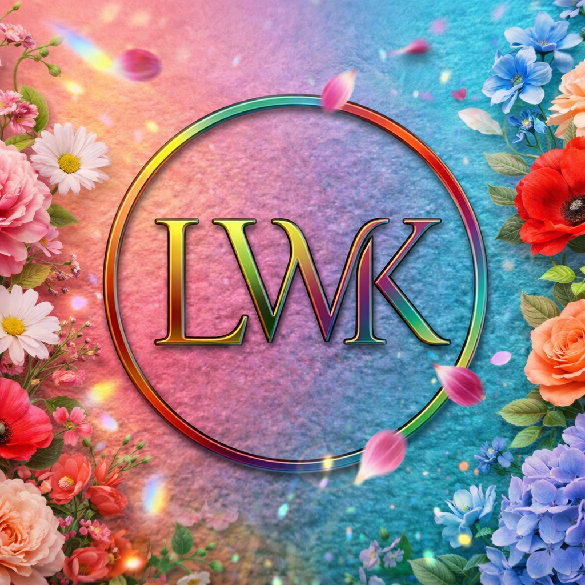

# Week 2: CSS Mastery Portfolio

## Author
- **Name:** Lucy Wachu
- **GitHub:** [@lucywachu77-dev](https://github.com/lucywachu77-dev)
- **Date:** March 25, 2026

## Project Description
This is my Week 2 portfolio assignment for CSS Mastery.  
It demonstrates responsive design, clean layouts, and CSS styling principles.  
The portfolio includes multiple projects showcasing HTML and CSS skills, Flexbox and Grid layouts, typography, color schemes, and responsive design for mobile, tablet, and desktop.

## Technologies Used
- HTML5
- CSS3 (hardcoded values, no CSS variables)

## Features
- Fully responsive layout across mobile, tablet, and desktop
- Flexbox and Grid layout for project cards
- Styled buttons with hover effects
- Accessible contact form with labels and placeholders
- Clean, modern design suitable for portfolio showcase

## How to Run
1. Clone this repository
2. Open `index.html` in your browser
3. All pages are already linked to `styles.css` for styling

## Lessons Learned
- Learned how to structure a portfolio using HTML and CSS
- Practiced Flexbox and Grid for responsive layouts
- Implemented a consistent typography system and color scheme
- Learned how to link multiple pages correctly and manage assets

## Challenges Faced
- Initial confusion with relative paths for images and project pages
- GitHub Pages 404 errors when links had `../` paths
- Learned to fix paths and test on GitHub Pages

## Screenshots
- **Home Page:** 
- **Contact Form:** 
- **Landing Page:** 

## Live Demo
[View Live Demo](https://lucywachu77-dev.github.io/iyf-s10-week-02-lucywachu77-dev/)